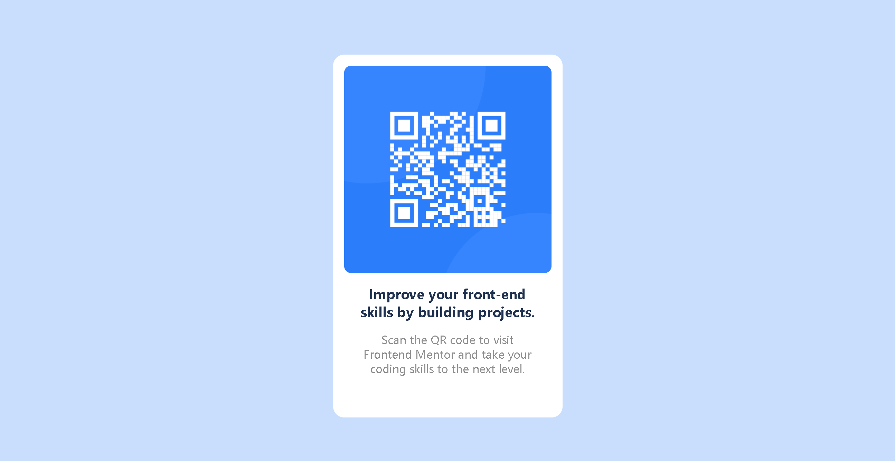

# Frontend Mentor - QR Code Component Solution
 
This is my solution to the [QR Code Component Challenge on Frontend Mentor](https://www.frontendmentor.io/challenges/qr-code-component-iux_sIO_H). Frontend Mentor challenges help you improve your coding skills by building realistic projects.
 
---
 
## Table of Contents
 
- [Overview](#overview)
  - [Screenshot](#screenshot)
  - [Links](#links)
- [My Process](#my-process)
  - [Built With](#built-with)
  - [What I Learned](#what-i-learned)
  - [Continued Development](#continued-development)
- [Author](#author)
 
---
 
## Overview
 
### Screenshot
 


### Links
 
- **Solution URL:** [View on Frontend Mentor](https://www.frontendmentor.io/solutions/qr-code-page-JObCyiFkmW)
- **Live Site URL:** [qr-code-component7070.netlify.app](https://qr-code-component7070.netlify.app)
 
---
 
## My Process
 
### Built With
 
- Semantic HTML5 markup
- CSS custom properties
- Flexbox
- Mobile-first workflow
 
### What I Learned
 
This challenge helped me practice writing clean, semantic HTML5 and understand how to center elements using Flexbox. A key snippet I'm proud of:
 
```css
body {
  display: flex;
  justify-content: center;
  align-items: center;
  height: 100vh;
}
```
 
This simple technique perfectly centers the card both horizontally and vertically on the page — something that used to feel tricky but now feels intuitive.
 
### Continued Development
 
In future projects, I want to focus on:
 
- **CSS Grid** — for more complex, two-dimensional layouts
- **CSS Animations** — to bring UI elements to life with smooth transitions and effects
 
---
 
## Author
 
- **Frontend Mentor** — [@Shradha7070](https://www.frontendmentor.io/profile/Shradha7070)
- **Twitter / X** — [@shradha_7070](https://x.com/shradha_7070)
 